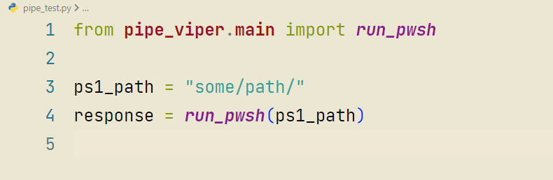

# Pipe Viper Plugin

* module will likely be renamed to pipe_viper_core, with a wrapper library that uses some dependencies (for fido2, oath, etc...)
* This core plugin is meant simply for time savings and only uses the standard Python library, the goal is no additional dependencies.
* Plugins may take dependencies in the future  
  
__Currently only supports running a single `.ps1` or `string` Powershell command.__  
I plan to add support for command scripts and other shells, as well as supporting libraries of useful script functionality. Though, this plugin will be primarily focused on PowerShell related functionality unless someone else expands on other shell support.

__SSH support is not completed yet__
Use with caution.

* <https://pypi.org/project/pipe-viper/>

## Usage

```
from pipe_viper.main import run_pwsh

ps1_path = "some/path/"
response = run_pwsh(ps1_path)
```  



### Goals

[] support SSH pipes
[] support bash/shell commands
[] support Telnet pipes

#### pipe_viper (not core)

[] fido2 support
